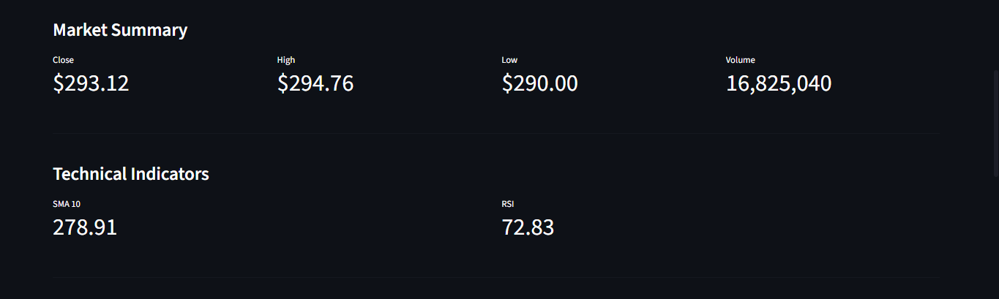
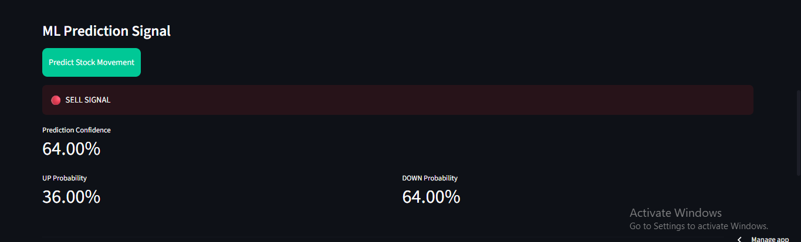
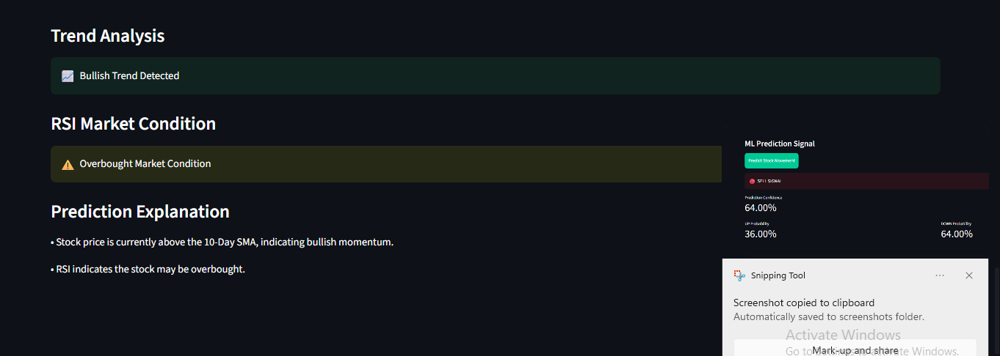
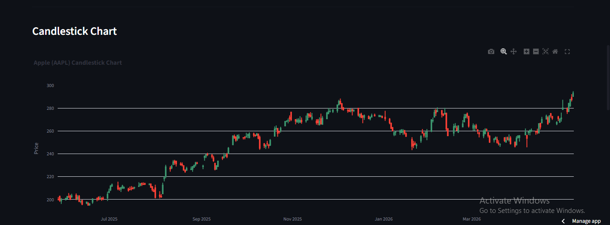

# 📈 AI-Powered Stock Price Movement Predictor

A live financial analytics dashboard that predicts stock price movement using Machine Learning, technical indicators, and real-time market data.

## 🚀 Live Demo

🔗 Live App: https://stock-price-movement-predictor-sanjula2003.streamlit.app/

🔗 GitHub Repository: https://github.com/Sanjula2003/stock-price-movement-predictor

---

## 📌 Project Overview

This project is an end-to-end Machine Learning application designed to analyze stock market data and generate Buy/Sell movement predictions.

The system fetches live stock data, calculates financial technical indicators, visualizes candlestick charts, and uses a trained Machine Learning model to predict whether the selected stock may move upward or downward.

---

## 🎯 Key Features

- Live stock market data using Yahoo Finance
- Stock selection dropdown for popular companies
- Technical indicators:
  - SMA 10
  - RSI
- Machine Learning-based Buy/Sell signal prediction
- Prediction confidence score
- Interactive candlestick chart
- Trend analysis
- RSI market condition analysis
- Explainable prediction insights
- Dark finance-style dashboard
- Deployed using Streamlit Cloud

---

## 🛠️ Technologies Used

- Python
- Pandas
- Scikit-learn
- Streamlit
- Plotly
- yFinance
- TA Library
- Joblib
- GitHub
- Streamlit Cloud

---

## 🤖 Machine Learning Workflow

1. Collected historical stock data using yFinance
2. Performed feature engineering using SMA and RSI indicators
3. Created a binary target variable:
   - 1 = Stock price may go up
   - 0 = Stock price may go down
4. Trained a Random Forest Classifier
5. Evaluated model performance
6. Saved the trained model using Joblib
7. Integrated the model into a Streamlit dashboard
8. Deployed the application online

---

## 📊 Model Used

### Random Forest Classifier

Random Forest was selected because it performs well on structured tabular data and can capture non-linear relationships between stock indicators and price movement.

---

## 📈 Dashboard Preview

📌 How to Run Locally

Clone the repository:

git clone https://github.com/Sanjula2003/stock-price-movement-predictor.git

Go to the project folder:

cd stock-price-movement-predictor

Install dependencies:

pip install -r requirements.txt

Run the Streamlit app:

streamlit run app.py
📁 Project Structure
stock-price-movement-predictor/
│
├── app.py
├── stock_movement_model.pkl
├── features.pkl
├── requirements.txt
├── README.md
└── notebooks/
📚 What I Learned

Through this project, I gained practical experience in:

Machine Learning classification
Financial data analysis
Feature engineering
Technical indicators
Model deployment
Streamlit dashboard development
Plotly visualization
GitHub project management
Real-world ML debugging
⚠️ Disclaimer

This project is built for educational and portfolio purposes only. It should not be used as financial advice or for real investment decisions.

👨‍💻 Author

Sanjula2003

GitHub: https://github.com/Sanjula2003